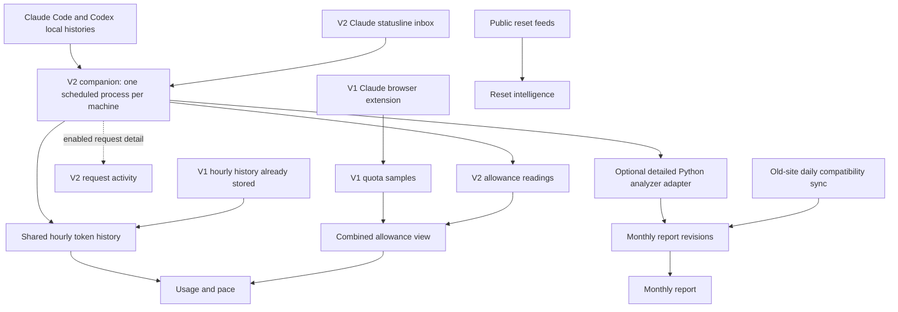

# Usage: how the system actually works

Current-state audit: September 13, 2026, approximately 18:29–18:32 UTC (1:29–1:32 PM Central). Verified against this checkout, the Windows installation, and read-only production database queries. Mac receipts were checked in production; Mac files, its scheduler, and Claude's account-hosted schedules were not inspected. This document describes the system before retirement work, not a completed migration.

Recovery update, 22:32 UTC: the Windows detailed-report credential path was repaired through a reviewed isolated release. The exact preserved September artifact and subsequent snapshots received authenticated receipts; a Task Scheduler invocation exited `0`, and the latest Windows September report is selected. The dated tables below remain the pre-recovery audit baseline. See the [USG-002 evidence](usage-evidence/usg-002-2026-09-13.md) for the changed state and remaining Mac/history limits.

Windows companion update, September 15 at 17:52–18:03 UTC: the installed executable was rebuilt from the current checkout and replaced with a preserved rollback copy; pairing, state, and the August 1 backfill pin were retained. The server accepted the build capability report, Task Scheduler read back installed at the desired 60-minute cadence with the explicit config directory pinned, two manual runs uploaded successfully with no rejected or retained rows, and the detailed Codex report published fresh receipts. The richer parser-generation replay is not complete: the first two passes reached the five-minute scan deadline after 11 and 16 Codex files (`partial_read`), while the concurrent Claude execution adapter timed out on the SQLite writer (`state_error`); later scheduled runs resume from committed per-file checkpoints. The binary still reports `2.0.0` because these changes are unreleased, so the version string alone cannot distinguish it from the older build. The two failing v1 Windows tasks remain present and were not removed. See [V2 collection](usage-collection.md#update-an-existing-windows-install) for Windows rollback and Mac update commands.

## Start here

The Observatory is partway through replacing its usage collectors. **V2 local collection works for Claude Code and Codex. V1 local jobs still exist, the Claude browser reader is still v1, and monthly reporting is a separate pipeline with gaps. Cursor collection is not implemented.**

There are three operating documents:

- This page: features, data flow, verified state, and remaining work.
- [V2 collection](usage-collection.md): supported installation, operation, settings, and accounting rules.
- [V1 retirement](usage-v1-retirement.md): historical components, preservation/migration requirements, and complete removal instructions.

[Usage coverage](usage-coverage.md) is the technical capability and roadmap matrix. “Supported when enabled” there does not mean enabled or receiving data in production. [Schedules](schedules.md) also covers unrelated tasks, standup, readings, and audit workflows.

## The version numbers describe different things

| Name | Meaning |
| --- | --- |
| V1 collector | Retired Python local collector and the still-operating Claude quota extension. Uses telemetry envelope `schema_version: 1` and `/api/v1/telemetry`. |
| V2 collector | Rust `observatory` companion, currently reporting version `2.0.0`. Uses usage envelope `schema_version: 2` and `/api/v1/usage`. |
| `/api/v1/...` | HTTP API namespace. The `v1` in the URL does **not** mean the collector is v1. Do not remove `/api/v1/usage` or `/api/v1/companion/*`. |
| Monthly report schema v2 | The detailed analyzer's report format, delivered to `/api/reports`. Independent of the collector envelope version. |
| Settings/config schema v1 | Version of that document, not evidence of a retired collector. |
| `token_bucket_revisions` | Existing hourly history table used by **both** collectors. It remains a live v2 dependency. |

## Data flow

Solid arrows describe built paths; they do not guarantee every producer is healthy. The Windows analyzer upload is currently failing. Cursor, provider Admin API readers, and v2 browser collection are absent from this working flow.

## Every feature in the Usage area

### Monthly report — `/usage`

Reads the latest nonfailed **machine/month report** from `report_revisions` via `/api/reports`. The browser refreshes once per visible minute; that is a read, not a fresh analysis. `/usage/reports` redirects here.

| Feature | What it does | Boundary |
| --- | --- | --- |
| Month and machine selection | Combines the selected machines' latest report for that calendar month. | A successful live collector does not imply a monthly report exists. |
| Token volume, calls, threads, average per call | Summarizes analyzer-observed local usage. | Available logs/retained ledgers only; cloud activity is not reconstructed. |
| Context composition and fresh/non-cached usage | Separates fresh input, cached input, cache writes, and output where available. | Reasoning is included in output, not added again. |
| Daily volume | Plots daily analyzer totals. | Daily totals cannot be converted into exact hourly activity. |
| API-equivalent pricing | Prices observed usage under the analyzer's versioned model, effort, context, and service-tier assumptions; exposes unpriced coverage. | A hypothetical API equivalent, not subscription spending or an invoice. |
| Environmental scenarios | Applies documented electricity, water, and carbon scenario assumptions and displays comparisons. | Modeled scenarios, not measured provider resource consumption. |
| Machine cards and source coverage | Shows each report's identity, snapshot time, scope, and missing-data detail. | A changed snapshot timestamp is not a collector scheduler health check. |
| Largest drivers, projects, work modes, task families, theme split | Uses the analyzer's transcript-based classifications and largest tasks to explain volume. | Heuristic attribution; this is separate from v2's optional project hashes. |
| Agent orchestration and knowledge-brain evidence | Displays analyzer-reported agent spawns, custom spawns, and direct/indirect brain signals. | Does not mean v2 tool/resource/agent attribution has shipped. |
| Measured next actions | Displays recommendations supplied by the analysis. | The dashboard does not invoke a model to generate them. |
| Month-to-date handling | Marks partial periods and suppresses misleading comparisons to a complete prior month. | Month rollover and successful final publication are separate from basic collection. |

Production had 34 stored monthly revisions at audit time. July and August history is retained. September has Mac Codex and Mac Claude reports, but **no Windows report**. Latest September snapshots: Mac Codex September 13 at 05:04 UTC; Mac Claude September 11 at 17:15 UTC. These timestamps do not establish which scheduler produced each revision.

### Usage & pace — `/usage/live` (now Tokens `/usage` and Allowances `/usage/allowances`)

USG-015 split this view, USG-017 replaced its Tokens half, USG-018 added API-equivalent cost and model cards, USG-020 added the filtered environmental section, and USG-023 rebuilt its Allowances half. `/usage` now opens on the filtered overview (`GET /api/usage-query`) with the monthly analyzer reports beneath as their own section, and `/usage/allowances` opens on one expandable card per account (every window side by side with remaining, reset countdown, outlook state, and observation time; expansion shows each window's burn history, projection, even-pace guide, and forecast explanation), with the model history beneath; `/usage/live` redirects to Allowances. The allowance rules below are unchanged: the current reading is the newest live reading of its own window, the persisted history range changes only the charts, and Spark windows start hidden.

The two new financial/model cards default to graphs, remember graph/table independently, share stable model colors, expose exact keyboard/touch detail and legend visibility, and preserve Unknown and unpriced rows in their tables. The cost graph uses daily per-model source price dates; missing request-pricing dates stay gaps, and the figure is labeled as a public-list-price API equivalent rather than spend or a bill. The environmental section applies methodology 2026-08-20.1 only to classified calls in the selected scope, shows the planning/floor/upper scenario comparison and missing-call coverage, and keeps its action destinations separate from the estimate. The September 15 recommendation evidence selects future-delivery Climeworks Technology focus removal, BEF Jordan River catchment restoration, and an unquantified Rewiring America contribution; a click, payment, promise, delivery, and retirement are never treated as the same state. These are source changes pending the broader USG-025 release; no production deployment is implied.

Reads `/api/usage-live`: canonical hourly totals from `token_bucket_revisions`, allowance history through `allowance_percent_view`, and retained report baselines. It currently looks back 35 days; data outside the view's horizon is not deleted.

| Feature | What it does | Boundary |
| --- | --- | --- |
| Account filter and hourly activity | Groups observed token counters by provider account, hour, and model. | Multiple revisions of a session/hour/model are canonicalized, never added together. |
| Observed tokens, recent burn, next 24 hours | Shows observed activity and extrapolates token velocity from complete hours, including idle time. | A token projection does not predict subscription allowance. |
| Current allowances | Shows recorded percentage used/remaining, the provider reset time, and separate pooled/model-scoped windows. | Account-wide observations can include cloud activity without identifying its tokens or project. |
| Cycle history and forecast | Solid observations, dashed projected percentage used at reset, and a guide for evenly spending a cycle. Uses current-window slope and/or a labeled historical prior. | Resets, stale samples, decreases, and gaps constrain forecasts. Windows are not summed. |
| Spark toggle | Hides or shows separate Codex Spark allowance windows. | Hiding a card does not stop collection or delete history. |
| Model history | Shows model call share and active hours during allowance cycles. | Does not allocate provider quota to individual models by converting tokens. |
| Waiting and coverage states | Explains missing logs/readings and collection issues. | A recent receipt can contain coverage only; it is not proof of provider data. |

The experimental cloud/uncollected token-equivalent and calibration UI is paused. Its backend/API and calibration evidence still exist. It contributes nothing to displayed token totals. The old daily-token budget UI has been removed.

### Reset calendar — `/usage/allowances#reset-calendar` (feed health moved to `/settings/feeds`)

Stores and displays attributed public reset claims, separate from personal allowance readings. It has a calendar, provider/type filters, event details, announcements, banked-reset lifecycle, and feed health. Concurrent changes in this checkout switch Codex feeds to NextReset, retain Reset Radar for Claude, and remove the old Codex Reset probability panel and forecast banner. Their production deployment was not verified by this usage audit. [Reset feeds](reset-feeds.md) owns the current allowlist and release evidence.

Feed history and forecasts are external claims. They do not reset an account, redeem a credit, or overwrite a provider's personal reset timestamp. Fetching and normalization use code, not model calls.

Opening the view can request a refresh, bounded by a shared 30-minute lease. `vercel.json` schedules a daily check at 13:15 UTC. The old `--refresh-feeds` local path belonged to v1; **the companion does not implement an hourly feed refresh**.

### Connections — `/settings` (formerly `/usage/connections`)

Pairs one companion per machine and binds it to provider accounts. Shows version, last run, accepted/rejected counts, settings version, identity state, and per-adapter coverage. Provides pause, disable, binding controls, identity reconfirmation, and update notices.

The separate **Browser collectors (v1 quota extension)** card controls the old Claude extension. “Add browser” currently issues a v2 pairing code even though there is no v2 browser collector to install. It does not connect the old extension. That setup invitation is ahead of the implementation.

An install, an account binding, a recognized sign-in, and a successful provider collection are four different states. A coverage-only run advances collector contact and no ledger, so the page now labels that line "last contact" and reports each binding's newest allowance reading, its reader, whether that reading is fresh at the install's cadence, and the adapter's `allowance` capability state beside it; a binding that shares an identity hash with an enabled sibling is marked with the recovery step. The browser card separates last contact from the newest sample the extension observed and when that sample was received. Each run also lists its accepted, duplicate, and rejected counts per record type, rejections broken down by reason. USG-014 added the health ladder (paired · bindings · identity · execution · records), the schedule verdict with the exact local action when the installed interval differs from the desired cadence, the build's capability report (version, digest, queue, backfill, detailed-report status per binding), and an overdue marker after two missed cadences; see [capability reports, health, and cadence](usage-collection.md#capability-reports-health-and-cadence). The general `/schedules` page still contains static `connected` flags from `lib/catalog.ts`, not an audit of each external scheduler.

### Collection settings — `/settings/collection` (formerly `/usage/settings`)

Stores global collection defaults and per-install overrides. Each run fetches effective settings; the local deny list can only restrict them. A supplied group replaces that whole group rather than merging individual fields. Settings never install a missing adapter.

| Setting group | Actual behavior today |
| --- | --- |
| Pause / provider switches | Gate collection on the next run. They do not uninstall scheduled jobs. |
| Cadence | Used when installing the OS service; ordinary runs do not rewrite the scheduler. The companion reads the installed interval back and the site shows `cadence pending` with the required action (`observatory service install` with the existing config directory) until the next report matches. |
| Claude and Codex execution | Built local transcript readers, including supported local desktop/IDE records. |
| Cursor execution/history/readers | Settings and discovery exist; collection is unimplemented and every Cursor value carries an `unsupported` chip from the builds' capability reports. |
| Detail level | `buckets_only` omits request uploads; `requests` emits requests without tool detail; `requests_with_tools` also emits supported local tool invocation/result rows, request tool totals, and, for knowledge sources configured on the machine, `resource.access` rows. |
| Subagents | Supported Claude and Codex local histories emit privacy-safe request attribution and lifecycle rows for distinct children, parents, roles, depth, and available requested/actual models. Unsupported or missing identity remains explicit Unknown. |
| Project attribution | `hashed` adds a structured working-directory identity and basis to supported local request records; local deny rules can force it off. The server registry and authenticated naming/mapping API join machine paths and worktrees through append-only revisions. Its read model preserves legacy hashes, canonicalizes logical-request revisions, and reports raw evidence separately from mapping coverage. The settings UI for those mappings remains future work. |
| Tool names / Cursor project hooks | Claude and Codex local tool names follow `off`, `builtin_only`, or `hashed_custom`; Cursor project hooks remain unimplemented. |
| Knowledge sources | Not a settings-document field. Sources (key, local roots, `mcp:`/`url:` connectors) live only in each machine's `companion.json`, added by `setup` from Obsidian's vault registry or by `observatory resources add`; the companion classifies supported Claude and Codex tool calls against them and uploads the source key, an opaque configuration token, and typed access codes at `requests_with_tools`, never a root. The local deny entry `execution.resource_attribution` keeps every row on the machine. The server registry and authenticated `/api/usage-knowledge-sources` naming/mapping API are built, the naming UI is Settings > Sources (USG-015), and the Tokens page's knowledge-source area (USG-022) reads the filtered result; the companion build carrying the classification has not been deployed, so those surfaces show their empty states in production. |
| Claude allowance reader | Statusline is built and now runs in the `claude_account` adapter, which binds each reading to the account stamped on it when the hook observed it and holds what it cannot attribute. `off` is the only value that stops it; the OAuth usage reader is still a stub, and selecting it keeps the statusline reader running as the documented fallback. The local deny entry `allowance.claude_reader.statusline` (or a dotted prefix) removes the reader whichever mode the server selects. |
| Codex allowance reader | Embedded rollout readings are built. App-server/web-backend readers are stubs; selecting them does not implement them and the settings page labels them `unsupported`. Embedded readings still arrive from execution, and `codex_execution` reports the Codex `allowance` capability row, including the `reader_fallback_embedded` state while a stub reader is selected. |
| Billing / Admin keys | Anthropic/OpenAI account usage and cost readers are stubs. No real money ingestion from these adapters yet. |
| Browser switches | V2 browser settings only. They do not pause the active v1 extensions; use their separate source controls. |
| Detailed monthly report | Runs a Python adapter only on bindings with analyzer and publisher configuration. Success is tracked separately in local `status`. |
| Live mode | `serve` is a placeholder. |
| Raw retention | Bounds normalized raw-observation retention locally; it is not a policy for deleting monthly reports or server history. |
| Update notice | Reports new companion releases; does not install or execute updates. Daily release lookup is configured at 13:45 UTC. |

## Cursor on this Windows machine

The database at `%APPDATA%\Cursor\User\globalStorage\state.vscdb` exists. Discovery reports Cursor present. The existing companion has an enabled Cursor binding and an install override enabling Cursor; its identity is unconfirmed. The last scheduled run reports `cursor_execution: prerequisite_missing / not_implemented`, with no records. `cursor_account` is off.

`companion/crates/observatory-adapters/src/stubs.rs` contains both Cursor adapters. They do not read usage, make network requests, or read a sign-in credential. Setup detection cannot make this implementation appear. Reinstalling Cursor, generating another binding, or approving identity again will not provide usage. The next implementation needs verified local/hosted source fixtures, identity handling, parsers, upload validation, and end-to-end evidence.

The current truthful status is **“Detected locally; collection not implemented.”** The Mac's last report uses an older `failed / unrecognized_payload` label for the same unfinished adapter. Both binaries report `2.0.0`, so version alone does not prove identical behavior.

## Verified operational state

| Process | Evidence from this audit | Interpretation |
| --- | --- | --- |
| Windows v2 companion | Scheduled hourly at minute 10; last run 13:10 Central, exit 0, 3 buckets and 2 records accepted, zero retained uploads/rejections. Version `2.0.0`; backfill pin August 1. | Local counters and embedded Codex allowances are publishing. The two records were allowances, not request detail. |
| Mac v2 companion | Latest server run 17:47 UTC; 1 bucket and 2 records accepted. | Receipt verified; Mac scheduler and local detailed outcomes not rechecked. |
| Windows v1 local tasks | Two `Personal Observatory Usage <source-id>` tasks remain enabled; both last exited 1 at 13:07 Central. | Retired producers still scheduled. Server-side disabling did not uninstall them. |
| Production v1 local sources | All four disabled. | Does not mean their historical rows or machine files can be discarded. |
| Claude v1 browser sources | Work and Personal sources enabled; unused third source disabled. Work last reading 17:48 UTC; Personal 04:54 UTC. | Active legacy dependency; Personal readings were already stale at audit time. |
| Windows Claude hook | Settings invoke the companion's `statusline` command in the shared config directory. | V2 hook installed. Only two v2 Claude readings exist, both from 05:10 UTC; installed is not continuously sampled. |
| Windows detailed Codex report | Binding configured; latest outcome `failed / HTTPError`; September report absent in production. | Exact HTTP status/root cause not established. Empty telemetry outbox does not cover the separate detailed outbox. |
| Windows detailed Claude report | No `detailed_report` block on its binding. | Global “on” cannot enable a missing analyzer configuration. |
| Windows AI monthly task | Active Codex automation titled “Monthly AI Usage,” local id `a`, first day at 09:00; prompt targets Token Observatory. | A separate model-driven schedule remains. Its actual upload destination comes from analyzer config and must be reconciled. |
| Windows Claude schedules | Default `~/.claude/scheduled-tasks` directory absent. | Does not prove there are no cloud, Cowork, custom-directory, WSL, or other-machine jobs. |
| Old-site compatibility sync | Daily 18:00 UTC entry remains in checked-in `vercel.json`. | Deployment configuration/last execution not independently verified here. Do not retire before report parity. |

Collection, analyzer scripts, feeds, and dashboard calculations use no model calls. An AI automation that launches those scripts still opens a model session, so “zero model calls” does **not** describe the whole current scheduling footprint.

## Stored history and migration boundaries

At audit time production contained 1,359 hourly revisions, 424 v1 quota samples, 526 v2 allowance readings, and 34 monthly report revisions. `activity_requests`, `account_usage_buckets`, and `money_entries` each contained zero rows. These are storage counts, **not additive usage totals**. Global request detail is `buckets_only` and project attribution is off.

Of 711 distinct v1 Codex account/session/hour/model keys, 704 lacked a companion copy. Of 83 Claude keys, 80 lacked a companion copy. This measures exact key overlap only, not equivalent underlying transcript coverage; the cause of low overlap needs reconciliation. It is sufficient to rule out deleting v1 history on the assumption that the companion has backfilled everything.

The current hourly reader preserves history from disabled sources. The allowance compatibility view does the opposite: it filters disabled v1 sources and disabled v2 bindings/installs. Consequently 251 quota samples from disabled local sources remain stored but are excluded through that view. Retirement must distinguish **stop new uploads** from **hide historical observations**.

USG-011 update, September 14: the [reconciliation evidence](usage-evidence/usg-011-2026-09-14.md) measured production read-only. The retired rows hold 3.95 billion of 8.87 billion canonical tokens on 783 v1-only keys, only 25 of which share an hour with companion rows, so the v1 history stays as coarse rows and is not double counted. The v1-only count over-states non-observation: the ledger stores an identical republication once, and both Windows outboxes classify entirely as duplicate or superseded against companion rows. All 251 hidden samples are Codex local rows, 219 of them exact copies of embedded readings. `20260914030000_reconcile_historical_ledgers.sql` changes the view policy (rows from a disabled source, binding, or install stay visible as `history_only`, exact copies show once) and the readers never select a history-only row as current; that migration reached production on September 16, together with the server build that reads it. `lib/usage-reconciliation.ts` and `scripts/reconcile-usage-history.mjs` reproduce the matrix and dry-run a pending v1 envelope.

Detailed reports remain in their full report structure. Hourly counters cannot reconstruct projects, pricing dimensions, task families, or exact per-request timestamps. Provider account aggregates are not interchangeable with locally derived hourly snapshots. See the [migration mapping and acceptance criteria](usage-v1-retirement.md#data-preservation-and-migration).

## Reconciliation order

1. Preserve source records, local ledgers, pending artifacts, receipts, and identities; measure canonical parity.
2. Repair Windows detailed publication and establish each machine/provider's monthly ownership before deleting redundant finalizers. Retain or replace the Claude ledger harvest so aging transcripts are not lost.
3. Uninstall the dead v1 local tasks/hooks and remove their runtime code after preserving data. Keep the active v2 service/hook.
4. Migrate v1 allowance history with provenance and preserve history visibility when disabling sources. Replace or explicitly end the v1 browser collection; remove its extension, source controls, and ingestion path after cutover.
5. Remove obsolete old-site sync, publisher credentials, AI usage schedules, installer/reference code, and contradictory instructions once their replacement checks pass.
6. Make the website expose implemented capabilities honestly: Cursor is detected but unsupported; browser pairing and unbuilt reader settings are not working setup paths. A successful telemetry run must not mask a failed monthly publication.

This audit changes documentation only. It does not claim that any schedule, production credential, collector, database row, or browser extension has been removed.
